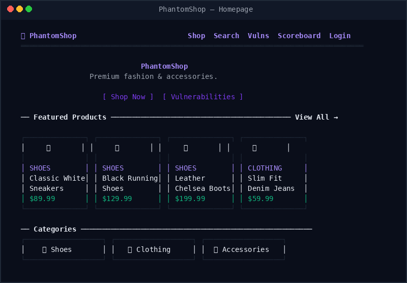
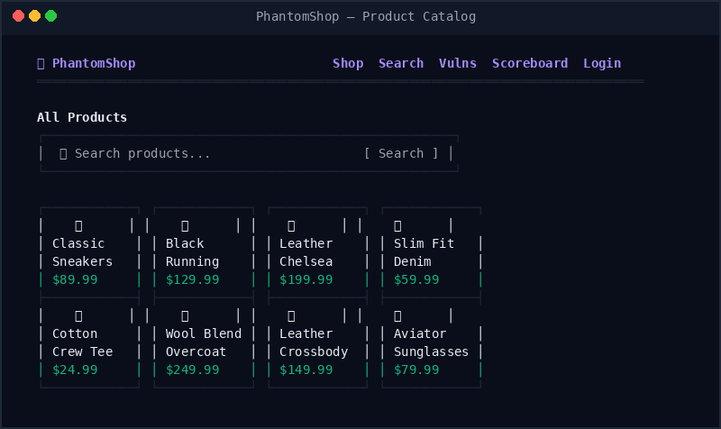
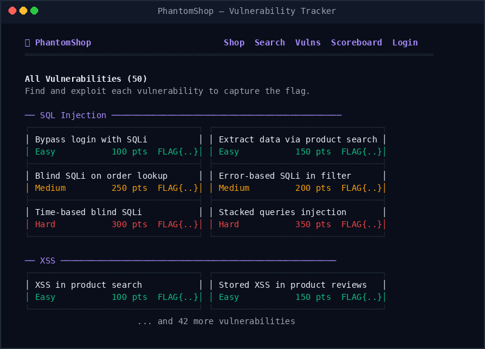
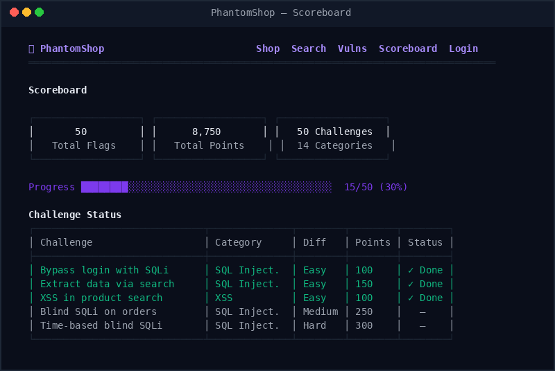

# PhantomShop

```
                      ___
                 ____/   \____
            ____/    _   _    \____
       ____/   _____/ \_/ \_____   \____
  ____/  _____/  PHANTOM SHOP  \_____  \____
 /______/____________________________\______\
        \___        ✦        ___/
            \_______•_______/

  [::] PhantomShop — Vulnerable E-Commerce Training
  [::] 50 Vulnerabilities | 14 Categories | Find Every Flag
```

**A realistic vulnerable e-commerce application for penetration testing practice.**

PhantomShop is a fully functional online fashion store with **50 hidden vulnerabilities** across **14 categories**. Your goal: find and exploit every vulnerability to capture all 50 flags.

---

## Screenshots

### Homepage


### Product Catalog


### Vulnerability Tracker


### Scoreboard


---

## Quick Start

```bash
# Clone and run
git clone https://github.com/Phantom-C2-77/PhantomRange.git
cd PhantomRange
go run ./cmd/server/

# Open http://localhost:9000
```

### Requirements
- Go 1.22+ ([install](https://go.dev/dl/))

### Docker (coming soon)
```bash
docker run -p 9000:9000 phantomshop
```

---

## What is PhantomShop?

A realistic fashion e-commerce website with:
- Product browsing, search, and filtering
- User accounts with profiles and avatars
- Shopping cart, checkout, and coupons
- Product reviews and ratings
- Admin panel with management tools
- REST API
- Newsletter, contact form, gift cards

Everything works like a real store. The vulnerabilities are embedded naturally in the code — just like real-world applications.

---

## The Challenge

**50 flags** are hidden throughout the application. Each flag looks like:

```
FLAG{s0m3th1ng_h3r3}
```

Find them by exploiting vulnerabilities in the application. Track your progress at **http://localhost:9000/scoreboard**.

Submit flags:
```bash
curl -X POST http://localhost:9000/flag \
  -H "Content-Type: application/json" \
  -d '{"flag":"FLAG{...}"}'
```

### Difficulty Breakdown

| Difficulty | Flags | Description |
|-----------|-------|-------------|
| Easy | 12 | Foundational attacks, minimal tooling needed |
| Medium | 24 | Requires tools and technique chaining |
| Hard | 14 | Advanced exploitation, creative thinking |

### Categories

SQL Injection • XSS • Authentication • IDOR • Business Logic • SSRF • File Upload • Command Injection • Path Traversal • Open Redirect • Information Disclosure • Deserialization • HTTP Security • Cryptography

Visit **http://localhost:9000/vulns** for the full list with difficulty ratings.

---

## Recommended Tools

- [Burp Suite](https://portswigger.net/burp) — HTTP proxy and scanner
- [curl](https://curl.se/) — command-line HTTP client
- [sqlmap](https://sqlmap.org/) — SQL injection automation
- [ffuf](https://github.com/ffuf/ffuf) — web fuzzer
- [Python](https://python.org) — scripting exploits
- Browser DevTools — inspect requests, cookies, DOM

---

## Tips

- Explore every feature of the store as a normal user first
- Check all input fields, URL parameters, cookies, and headers
- Look at HTTP responses carefully — errors and headers reveal information
- Not every vulnerability is on a web page — check the API too
- Some flags require chaining multiple vulnerabilities together
- The admin panel exists but you need to find your way in

---

## Disclaimer

**This application is intentionally vulnerable.** Do NOT expose it to the internet. Run it locally or in an isolated network for training purposes only.

---

## Author

**Opeyemi Kolawole** — [GitHub](https://github.com/Phantom-C2-77)

## License

BSD 3-Clause
